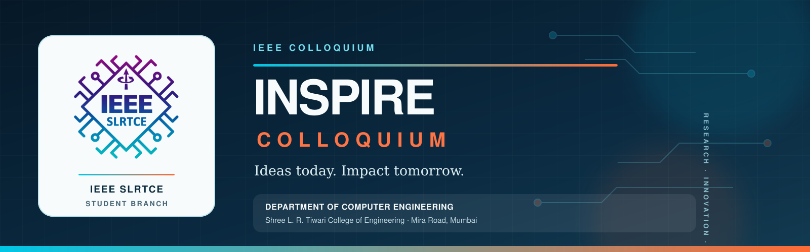
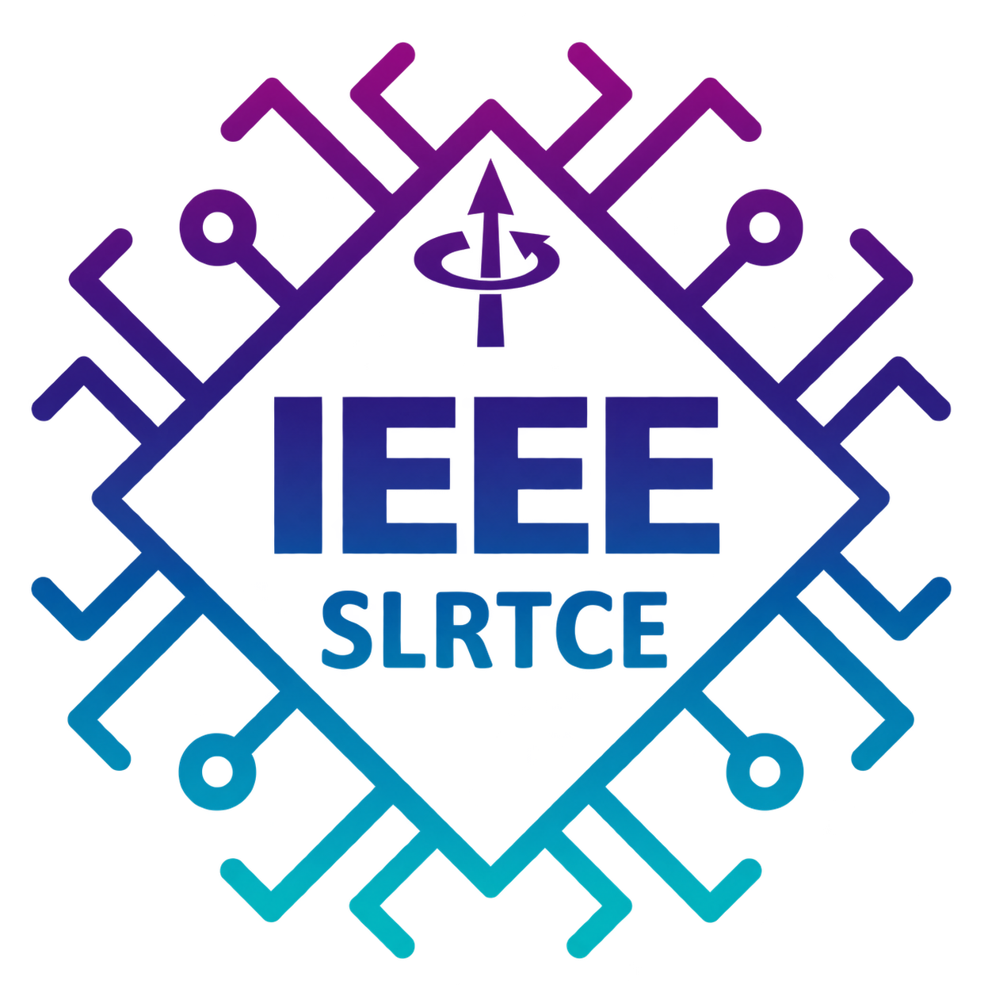

  

  

<h1 align="center">INSPIRE COLLOQUIUM</h1>

  <strong>Ideas Today. Impact Tomorrow.</strong>

  An initiative of the <strong>IEEE SLRTCE Student Branch</strong> 
  and the <strong>Department of Computer Engineering</strong> 
  Shree L. R. Tiwari College of Engineering

  
  
  
  

---

## Welcome to INSPIRE

**INSPIRE Colloquium** is a multidisciplinary platform for students, researchers and innovators to present meaningful ideas, exchange knowledge and explore solutions with real-world impact.

The colloquium brings together academic curiosity, technical creativity and responsible innovation through research presentations, expert evaluation and collaborative learning.

> **INSPIRE represents Ideas, Science, Progress, Innovation, Research and Exploration.**

---

## Our Purpose

| 💡 Ideas | 🔬 Research | ⚙️ Innovation | 🌏 Impact |
|:---:|:---:|:---:|:---:|
| Turn curiosity into focused and meaningful research. | Encourage structured exploration and evidence-based thinking. | Build practical solutions for emerging challenges. | Connect technical work with society and the future. |

---

## Research Tracks

| Track 01 | Track 02 | Track 03 |
|---|---|---|
| 🤖 **Artificial Intelligence & Machine Learning** | 🌐 **Internet of Things** | 🩺 **Healthcare Technologies** |
| 🌱 **Sustainability & Green Technology** | 🔐 **Cybersecurity & Digital Trust** | 🦾 **Automation & Robotics** |
| 💳 **Financial Technology** | ⛓️ **Blockchain** | 🚀 **Emerging Technologies** |

---

## Who Can Participate?

| Category | Participation | Focus |
|:---:|:---:|---|
| **UG** | Team participation | Learn, create, present and grow |
| **PG** | Individual participation | Research, collaborate and connect |
| **PPG** | Individual participation | Explore, contribute and create impact |

---

## Registration

🟢 **Registrations are currently open.**

Students and researchers from the eligible categories are invited to submit their ideas and become part of the INSPIRE journey. Official registration instructions are shared through the event website and authorised communication channels.

---

## Important Dates

| Milestone | Date |
|---|:---:|
| Registration opens | **21 September** |
| Abstract submission closes | **11 October** |
| Shortlisted teams announced | **13 October** |
| Event day | **17 October** |

> **Registration fee for shortlisted teams:** ₹300 per team. Payment is required only after selection; official payment instructions will be shared separately with shortlisted teams.

---

## The INSPIRE Digital Ecosystem

This GitHub account supports the technology developed for managing the complete colloquium journey:

- Event information and participant experience
- UG, PG and PPG registration workflows
- Abstract submission and evaluation
- Secure administrative operations
- Selection and payment monitoring
- Participant communication
- Event continuity for future organising teams

The project is designed so future student teams can maintain, improve and responsibly hand over the platform.

---

## Our Principles

- **Clarity** in research and communication
- **Integrity** in evaluation and event operations
- **Accessibility** for participants across categories
- **Security** in handling participant information
- **Continuity** through documentation and responsible handover
- **Impact** through ideas that address meaningful challenges

---

## Organised By

**IEEE SLRTCE Student Branch**  
**Department of Computer Engineering**  
**Shree L. R. Tiwari College of Engineering**  
Mira Road, Mumbai, Maharashtra, India

---

## Contact

For official queries and participant support:

**Email:** [colloquium.ieee@slrtce.in](mailto:colloquium.ieee@slrtce.in)

---

  <strong>INSPIRE COLLOQUIUM</strong> 
  Research · Innovation · Exploration · Impact

  Made with purpose by the IEEE SLRTCE Student Branch

